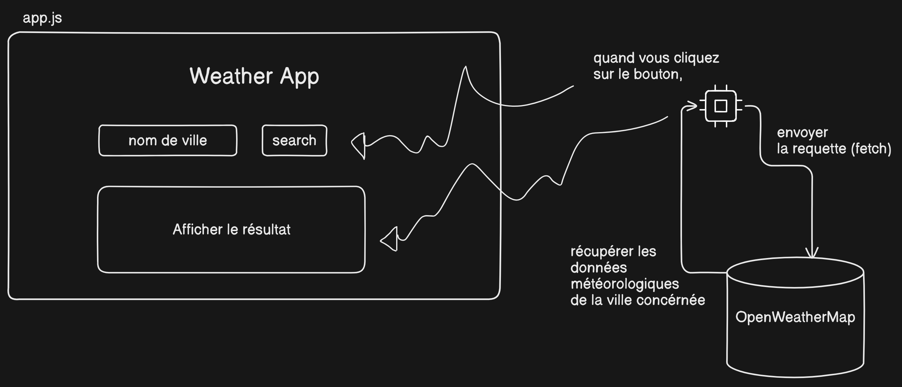

# Application de météo 
Il s'agit d'un TP basique réalisé en utilisant ReactJs. Les utilisateurs ont la possibilité de chercher des informations météorologiques pour leurs différentes villes..

## Fonctionnalités
- Rechercher des informations météorologiques par nom de ville
- Afficher la température actuelle, les conditions météorologiques tels que (humidité, vent) et le nom de la ville

  
## Technologies utilisées
- ReactJs
- Axios (pour effectuer des requêtes API)
- API OpenWeatherMap (pour obtenir les données)
- HTML/CSS (pour l'interface utilisateur)

## Pour commencer
Pour exécuter l'application météo localement, suivez ces étapes :
1. Clonez le dépôt :
   git clone https://github.com/sife22/weather-reactjs.git
2. Accédez au répertoire du projet :
   cd weather-reactjs
3. Installez les dépendances :
   npm install
4. Créez un fichier '.env' dans le répertoire racine et ajoutez votre clé API (OpenWeatherMap) :
   REACT_APP_WEATHER_API_KEY=votre_cle_api
5. Démarrez le serveur de développement :
   npm start
6. Ouvrez votre navigateur et visitez 'http://localhost:3000' pour voir l'application.

## Déploiement
Cette application météo est hébergée sur Netlify. Vous pouvez visiter l'application sur : https://weather-app-reactjs-master.netlify.app/

## Améliorations possibles à l'avenir
- Ajouter la possibilité d'afficher les prévisions météorologiques pour les prochains jours.
- Mettre en place un affichage d'informations météorologiques plus détaillé...
- Améliorer l'interface utilisateur avec un style et des animations supplémentaires.

## Contact
- Téléphone - Phone : +212 669 08 44 87
- Adresse e-mail - Mail : sifeddinehadi22@gmail.com
